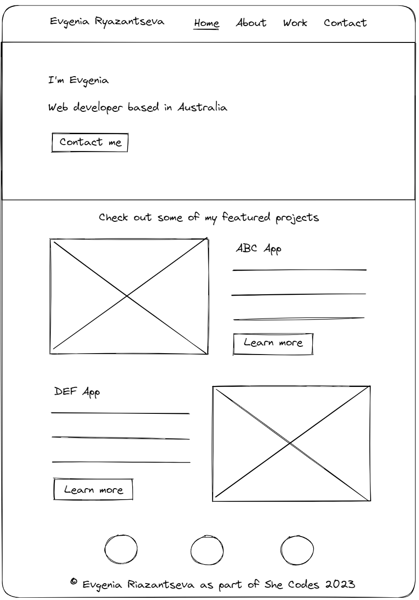
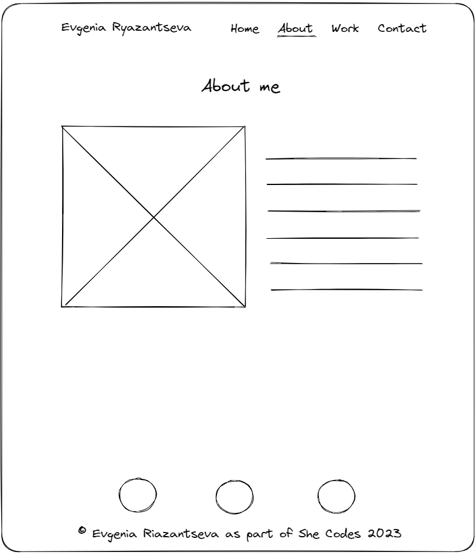
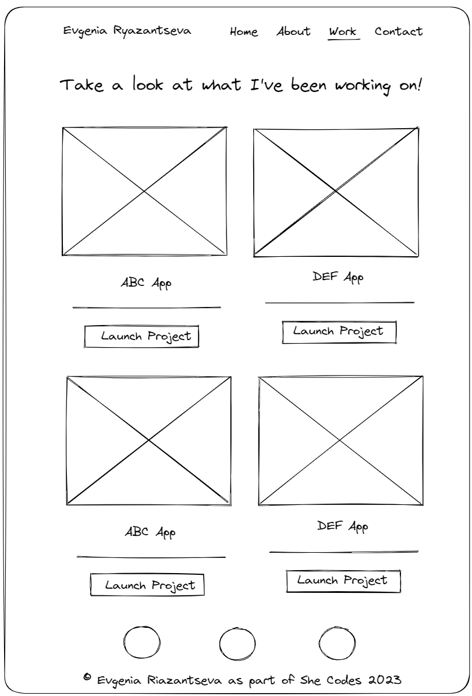
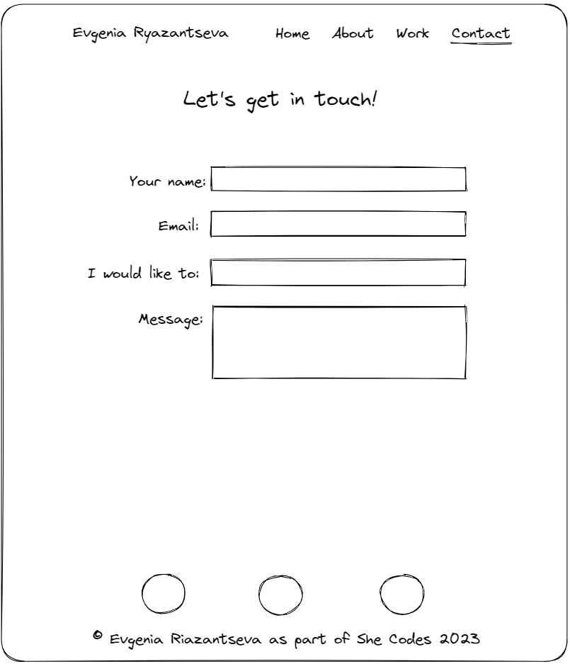
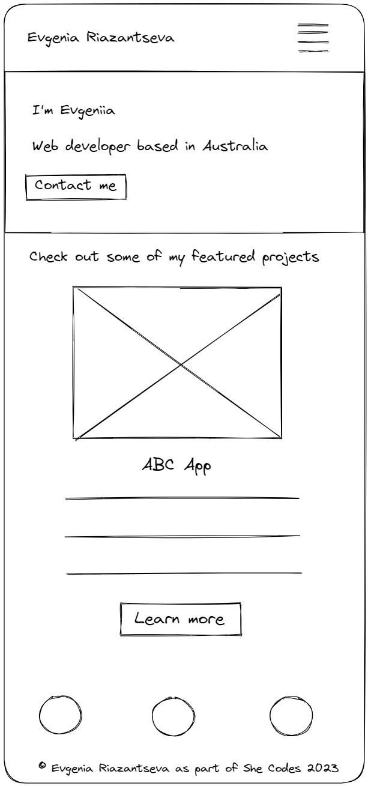
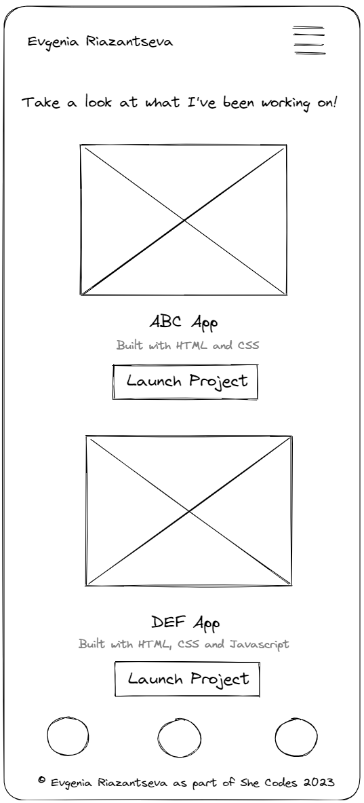

# Evgeniia Riazantseva - Portfolio Task
[My portfolio site] ( https://eoryazantseva.github.io/evgenia-ryazantseva-portfolio/ )

## Project Requirements

### Content

- [ ] At least one profile picture
- [ ] Biography (at least 100 words)
- [ ] Functional Contact Form
- [ ] "Projects" section
- [ ] Links to external sites, e.g. GitHub and LinkedIn.

The project contains profile picture and biography on the About page, functional contact form on the Contact Page, Projects section on the Homepage and the Work page, links to GitHub, LinkedIn and Facebook in the foooter.

### Technical

- [ ] At least 2 web pages.
- [ ] Version controlled with Git
- [ ] Deployed on GitHub pages.
- [ ] Implements responsive design principles.
- [ ] Uses semantic HTML.

The project contains 4 web pages. It's version controlled with Git and deployed on GitHub pages. Responsive design peinciples are implemented with breakpoint at 768px and 992px.

### Bonus

- [ ] Different styles for active, hover and focus states.
- [ ] Include JavaScript to add some dynamic elements to your site.

The project includes different styles for active, hover, and focus states for the links, including buttons and navigation menu items. The project includes Javascipt for the dynamic hamburger menu for the mobile and tablet screens.

### Wireframes 

Created in Excalidraw to show basic layout on desktop and mobile.

- [ ] Wireframe Homepage Desktop 

  

- [ ] Wireframe About Desktop

- [ ] 

- [ ] Wireframe Work Desktop

  

- [ ] Wireframe Contact Desktop

  

- [ ] Wireframe Homepage Mobile

  

- [ ] Wireframe About Mobile

  

- [ ] Wireframe Work Mobile

  

- [ ] Wireframe Contact Mobile

  

## Typography
- [ ] Playfair Display is a text font for headings imported from Google fonts.
- [ ] Open Sans is a default text font imported from Google fonts.

## Brand colors

| Color             | Hex                                                                |
| ----------------- | --------- |
| Orange | #FC4C02 |
| Blue   | #011A70 |
| Sky    | #E1E7FF |
| Black  | #36394D |

## Screenshots Desktop

- [ ] Desktop screenshot Homepage

  
  
- [ ] Desktop screenshot About page 

  
  
- [ ] Desktop screenshot Work page

  
  
- [ ] Desktop screenshot Contact Page 

  

## Screenshots Mobile

- [ ] Mobile screenshot Homepage 

  
  
- [ ] Mobile screenshot About page

  
  
- [ ] Mobile screenshot Work page  

  
  
- [ ] Mobile screenshot Contact page 

  

